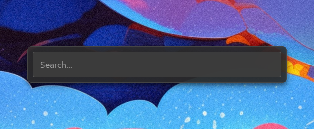
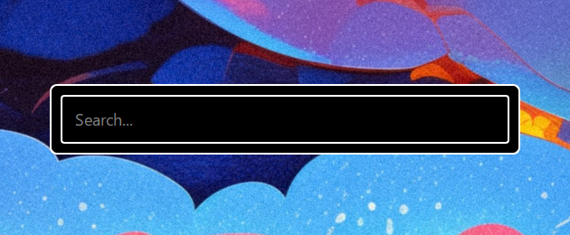
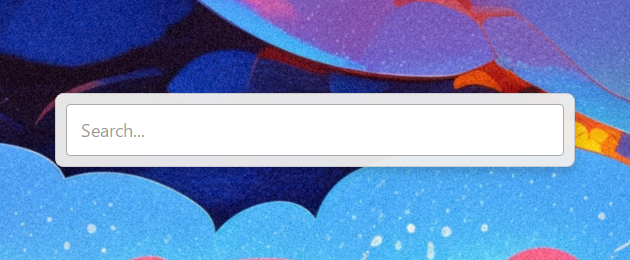
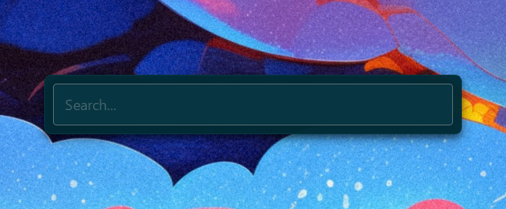
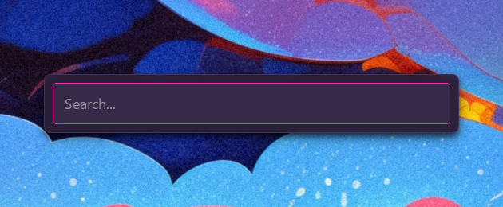

# Themes

<a href="Configuration.md" style="text-decoration:none"><kbd style="background:#30363d;color:#e6edf3;border:none;padding:3px 10px;border-radius:5px">← Configuration</kbd></a>

Themes control the full visual appearance of InputBar. They are stored as `.json` files in `Data/Themes/`.

## Switching themes

Open `Data/Settings.json` and set the `"Theme"` key to the filename of the theme you want, **without** the `.json` extension:

```json
{
    "Theme": "theme_default"
}
```

Then reload InputBar (`Settings Reload` in the search bar, or restart the app).

---

## Available themes

**WILL ADD PICTURE LATER, SORRY. BUT THEY ARE AVAILABLE**

### `theme_default`
<p align="center"></p>

### `theme_catppuccin_latte`
<p align="center"></p>

### `theme_catppuccin_mocha`
<p align="center"></p>

### `theme_dracula`
<p align="center"></p>

### `theme_gruvbox`
<p align="center"></p>

### `theme_high_contrast`
<p align="center"></p>

### `theme_light`
<p align="center"></p>

### `theme_material_palenight`
<p align="center"></p>

### `theme_monokai`
<p align="center"></p>

### `theme_nord`
<p align="center"></p>

### `theme_solarized_dark`
<p align="center"></p>

### `theme_solarized_light`
<p align="center"></p>

### `theme_synthwave`
<p align="center"></p>

---

## Creating your own theme

1. Copy any existing theme from `Data/Themes/` and rename it (e.g. `mytheme.json`).
2. Edit the values to your liking — see the key reference below.
3. Set `"Theme": "mytheme"` in `Data/Settings.json` and reload.

Any key you omit will automatically fall back to its default value on next startup.
Custom themes are never overwritten by updates.

### Key reference

#### `window`
| Key | Type | Description |
|---|---|---|
| `width`  | int | Total window width in pixels |
| `height` | int | Total window height in pixels |
| `margin` | int | Outer margin around the container |

#### `container`
| Key | Type | Description |
|---|---|---|
| `background`      | CSS color      | Container background |
| `border`          | CSS border     | Container border |
| `border_radius`   | CSS value      | Container corner rounding |
| `shadow_color`    | `[R, G, B, A]` | Drop shadow color (0–255 each) |
| `shadow_blur`     | int            | Drop shadow blur radius |
| `shadow_x_offset` | int            | Drop shadow horizontal offset |
| `shadow_y_offset` | int            | Drop shadow vertical offset |
| `padding`         | int            | Inner padding of the container |
| `spacing`         | int            | Spacing between search bar and results list |

#### `search_bar`
| Key | Type | Description |
|---|---|---|
| `background`   | CSS color | Search bar background |
| `text_color`   | CSS color | Input text color |
| `border`       | CSS border | Search bar border |
| `border_radius`| CSS value | Search bar corner rounding |
| `padding`      | CSS value | Internal padding of the input |
| `font_size`    | CSS value | Font size of the input text |
| `font_family`  | string    | Font family of the input text |
| `placeholder`  | string    | Placeholder text when empty |

#### `results_list`
| Key | Type | Description |
|---|---|---|
| `background`          | CSS color | List background |
| `text_color`          | CSS color | Default item text color |
| `selected_background` | CSS color | Selected item background |
| `selected_text_color` | CSS color | Selected item text color |
| `font_size`           | CSS value | Font size of list items |
| `font_family`         | string    | Font family of list items |
| `item_padding`        | CSS value | Padding inside each item |
| `item_border_radius`  | CSS value | Corner rounding of each item |
| `height`              | int       | Fixed height of the results list in pixels |

#### `scrollbar`
| Key | Type | Description |
|---|---|---|
| `width`             | CSS value | Scrollbar width — `"0px"` hides it (default) |
| `background`        | CSS color | Scrollbar track background |
| `handle_color`      | CSS color | Scrollbar handle color |
| `handle_hover_color`| CSS color | Scrollbar handle color on hover |
| `border_radius`     | CSS value | Scrollbar handle corner rounding |

---

Colors accept any valid CSS format: `rgba(R, G, B, A)`, `#RRGGBB`, `#RGB`, or named colors (`white`, `transparent`, etc.).
