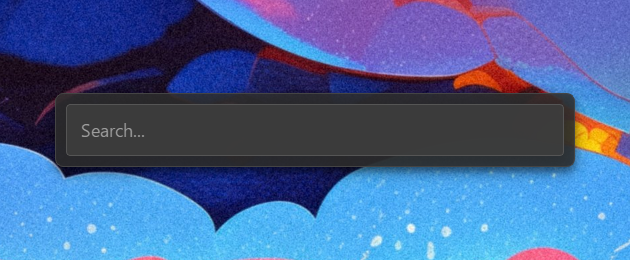

<div align="center">
  <h1 style="font-size: 3em; font-weight: 500">
  
【 𝗜𝗻𝗽𝘂𝘁𝗕𝗮𝗿 】

  </h1>
</div>

<p align="center">
  
</p>

<p align="center">
  <a href="https://github.com/BlessEphraem/InputBar/releases">
    
  </a>
  
  <a href="https://github.com/BlessEphraem/InputBar/releases">
    
  </a>
  <a href="https://github.com/BlessEphraem/InputBar/blob/main/LICENSE">
    
  </a>
</p>

A fast application launcher for Windows, triggered by a global keyboard shortcut.  
Minimal interface, plugin-based, fully configurable through JSON files.

<p align="center">
  
</p>

---

## ✨ Features

- **App search** — fuzzy search across all installed apps (Start Menu, LOCALAPPDATA, Windows registry, UWP/Store)
- **Built-in calculator** — type `2 + 2`, the result appears and copies to clipboard
- **System commands** — lock, sleep, restart, shutdown (with confirmation step)
- **App submenu** — press right arrow on any app to access "Start as admin" / "Open folder"
- **Customizable shortcuts** — standard keys or Windows key via low-level hook
- **Fully themeable** — colors, borders, transparency via JSON
- **IPC pipe** — can be triggered from external scripts (AutoHotkey, etc.)
- **User data persistence** — updates inject new keys without overwriting existing settings

## Usage

| Action | Shortcut |
|---|---|
| Open InputBar | `Ctrl+Space` *(default)* |
| Navigate results | `↑` / `↓` |
| Launch selection | `Enter` |
| Open app submenu | `→` |
| Go back | `←` or select "Back" |
| Close InputBar | `Escape` |

### App submenu (`→`)

When an application is selected, pressing the right arrow shows:

```
▶  Start as admin     → Launch with UAC elevation
   Open folder        → Open install folder in Explorer
←  Back               → Return to search (state preserved)
```

### Calculator

Type any math expression directly. If InputBar recognizes it, the result appears at the top. Press `Enter` to copy it to the clipboard.

```
2 + 2         →  = 4
(10 * 3) / 4  →  = 7.5
2 ^ 8         →  = 256
```

### System commands

Type `system` to list all available commands, or type directly what you need:

| Term | Action |
|---|---|
| `lock` | Lock the session |
| `sleep` | Sleep |
| `restart` / `reboot` | Restart |
| `shutdown` | Shut down |

A confirmation step is always required before any system command is executed.

### Plugin management

Type `plugin` or `core` to list all loaded modules and toggle them on/off.


# ⚙️ Configuration
To keep the program as lightweight as possible, it does not include a Graphical User Interface (GUI). Instead, everything is managed through simple .json configuration files.

Don't worry if you're not a developer - configuring the app is straightforward! I've written detailed guides to walk you through the process step by step. [Please check out there to get started.](.docs/Configuration.md)

---

# 🛠️ Tech Stack
- Python 3.11+
- PyQt6
- rapidfuzz
- keyboard
- pywin32  (optional — .lnk shortcut resolution)

# 📄 License

GPL-3.0 license - see [LICENSE](LICENSE) for details.
