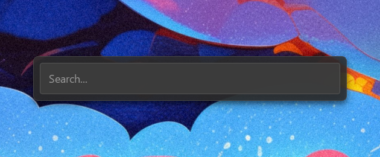

  <h1 style="font-size: 3em; font-weight: 500">
  
【 𝗜𝗻𝗽𝘂𝘁 𝗕𝗮𝗿 】

  </h1>

  

  
  
  
  

 

A fast application launcher for Windows, triggered by a global keyboard shortcut.  
Minimal interface, plugin-based, fully configurable through JSON files.

<!-- wiki-hide-start -->
 

  
  

 
<!-- wiki-hide-end -->

  

 

## ✨ Features

- **App search** — fuzzy search across all installed apps (Start Menu, LOCALAPPDATA, Windows registry, UWP/Store)
- **File search** — integrates [voidtools Everything](https://www.voidtools.com/) for instant file and folder search
- **Built-in calculator** — type `2 + 2`, the result appears and copies to clipboard
- **System commands** — lock, sleep, restart, shutdown (with confirmation step)
- **Result submenu** — press `→` on any app or file to access Start as admin / Open folder / Copy file path
- **Shell shortcuts** — named command shortcuts with fuzzy search, per-entry shell override
- **Customizable shortcuts** — standard keys or Windows key via low-level hook
- **Fully themeable** — colors, borders, transparency, icon tints via JSON
- **IPC pipe** — can be triggered from external scripts (AutoHotkey, etc.)
- **User data persistence** — updates inject new keys without overwriting existing settings

## 🛠️ Tech Stack
- Python 3.11+
- PyQt6
- rapidfuzz
- pywin32  (optional — .lnk shortcut resolution + exe icon extraction)

## 🔧 Versioning

`_version.py` is auto-generated by CMake at build time from `_version.py.in` and is gitignored.  
In dev mode (running from source) it is absent — `Updater.py` catches the `ImportError` and skips the update check.  
Never edit `_version.py` manually; bump the version in `build/project.json` instead.

## 📄 License

GPL-3.0 license - see [LICENSE](LICENSE) for details.
